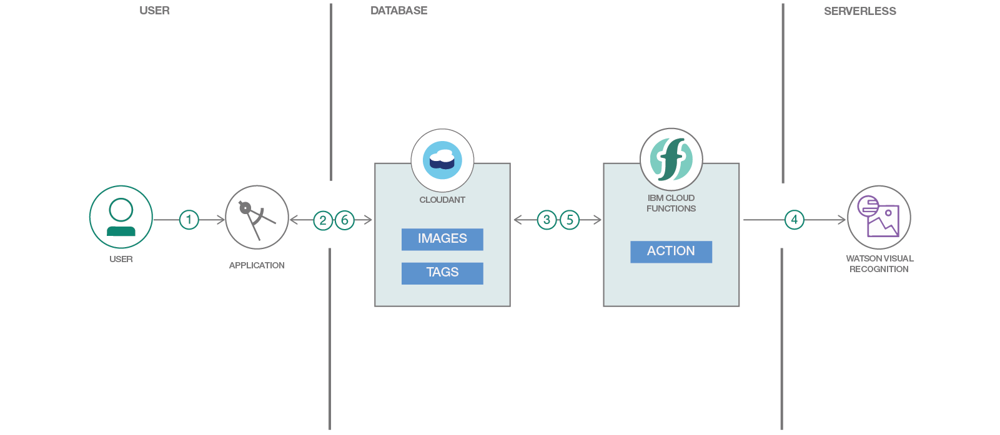
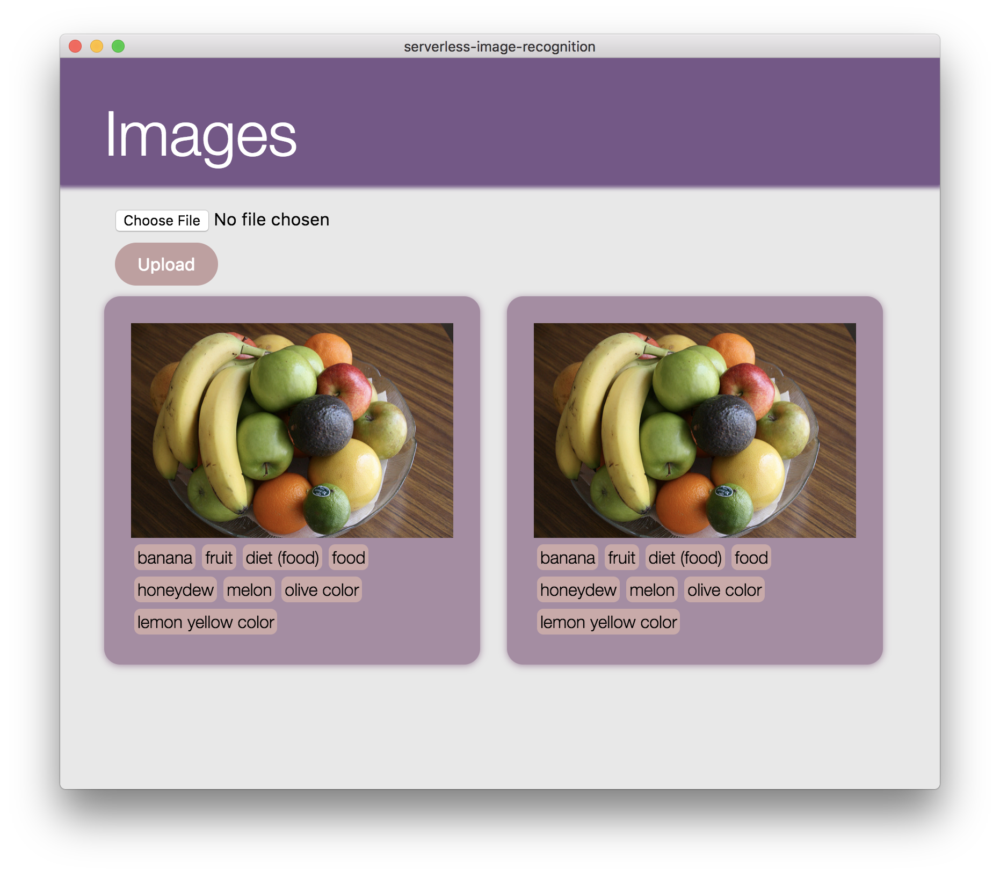

# serverless-image-recognition

## Flow

1. User takes or chooses a picture from the gallery.
2. The image is stored in the Cloudant database.
3. Cloud Function is triggered when there's a new image in the database.
4. Cloud Function gets the image and uses Watson Visual Recognition to process the image.
5. Cloud Function stores the results (classes with scores) from Visual Recognition in the database.
6. The user can see the new tags or classes in the image they uploaded.

> initial ios app

